# DESPLIEGUE — Evidencias y respuestas

Este documento recopila todas las evidencias y respuestas de la practica.

---

## Parte 1 — Evidencias minimas

### Fase 1: Instalacion y configuracion

1) Servicio Nginx activo
- Que demuestra: El servicio Nginx se encuentra activo y funcionando correctamente dentro del contenedor Docker.
- Comando: ``docker compose ps`` y ``docker exec -it nginx-web service nginx status``
- Evidencia:


2) Configuracion cargada
- Que demuestra: La configuracion personalizada de Nginx ha sido correctamente cargada y esta siendo utilizada por el servidor web.
- Comando: ``docker exec -it nginx-web ls -l /etc/nginx/conf.d/``
- Evidencia:


3) Resolucion de nombres
- Que demuestra: El nombre de dominio configurado como ``rocio-app`` en lugar de una direccion IP. Para llegar a este punto, primero configuré el archivo ``hosts`` en mi sistema operativo local, agregando la siguiente linea: ``127.0.0.1    rocio-app``.
- Evidencia:


4) Contenido Web
- Que demuestra: El contenido web personalizado de Cloud Academy ha sido correctamente desplegado y es accesible a traves del navegador web.
- Evidencia:


### Fase 2: Transferencia SFTP (Filezilla)

5) Conexion SFTP exitosa
- Que demuestra: La conexion SFTP al servidor ha sido exitosa, permitiendo la transferencia segura de archivos.
- Evidencia:


6) Permisos de escritura
- Que demuestra: Para probar que puedo subir archivos, creo un archivo de prueba en mi ordenador (`prueba.txt`) y lo arrastro desde el panel izquierdo al panel derecho de Filezilla. En la primera captura se muestra el mensaje de transferencia exitosa, y en la segunda captura se puede ver el archivo `prueba.txt` en el directorio del servidor.
- Evidencia:


### Fase 3: Infraestructura Docker

7) Contenedores activos
- Que demuestra: Los contenedores Docker necesarios para el despliegue de la aplicacion estan activos y funcionando correctamente en los puertos ``0.0.0.0:8080->80/tcp`` y ``0.0.0.0:2222->22/tcp``.
- Comando: ``docker compose ps``
- Evidencia:


8) Persistencia (Volumen compartido)
- Que demuestra: Demuestra que lo que transfiero por SFTP se ve en la web. Primero creé un archivo HTML de prueba y lo subí a la carpeta `upload` del servidor a traves de Filezilla. Luego, accedi a ese archivo desde el navegador web utilizando la URL: `http://rocio-app:8080/prueba.html`.
- Evidencia:


9) Despliegue multi-sitio
- Que demuestra: El despliegue de un sitio web adicional en la ruta /reloj ha sido exitoso, mostrando un reloj digital en tiempo real. 
- Problema que encontré: Al acceder a `http://localhost:8080/reloj`, Nginx genera una **redirección 301** a `http://localhost/reloj/` (sin incluir el puerto 8080). El navegador intenta conectar entonces al puerto 80 (por defecto) donde no hay servicio, mostrando el mensaje de error: "localhost ha rechazado la conexión". Para solucionarlo, creé el archivo `config/default.conf` con la directiva `absolute_redirect off;` que hace que Nginx genere redirecciones **relativas** en lugar de absolutas, preservando así el puerto del cliente:

```bash
server {
    listen 80;
    listen [::]:80;
    
    server_name localhost rocio-app;
    
    # Evita redirecciones absolutas
    absolute_redirect off;

    root /usr/share/nginx/html;
    index index.html index.htm;

    location / {
        try_files $uri $uri/ =404;
    }
}
```

Añado en el archivo ``docker-compose.yml`` el montaje de este archivo de configuración personalizado:

```yaml
    volumes:
      - ./web:/usr/share/nginx/html
      - ./config/default.conf:/etc/nginx/conf.d/default.conf:ro
``` 
- Evidencia:


### Fase 4: Seguridad HTTPS

10) Cifrado SSL
- Que demuestra: La generación de certificados SSL autofirmados utilizando OpenSSL para habilitar conexiones seguras HTTPS en el servidor Nginx. Se muestra en las evidencias el mensaje de advertencia del navegador al tratarse de un certificado autofirmado, y el candado en la barra de direcciones que indica una conexión segura.
- Comando: 
```bash
  cd certificados
  openssl req -x509 -nodes -days 365 -newkey rsa:2048 -keyout nginx-selfsigned.key -out nginx-selfsigned.crt
```

Posteriormente, configuré los archivos de `default.conf` y `docker-compose.yml` para habilitar HTTPS en Nginx.

- Evidencia:


11) Redireccion forzada
- Que demuestra: La redireccion forzada de todas las solicitudes HTTP a HTTPS utilizando una redireccion 301 en Nginx.
- Problema que encontré: Inicialmente, cuando intentaba acceder a `http://localhost:8080`, obtenía un error `ERR_SSL_PROTOCOL_ERROR`. La causa era que la redirección que generaba Nginx era incompleta. Si usaba `return 301 https://$host$request_uri;`, la variable ``$host`` solo devolvía ``localhost``, sin incluir el puerto 8080. Eso provocaba que la redirección se hiciera hacia ``https://localhost/`` (sin puerto), por lo que el navegador intentaba conectarse automáticamente al puerto 443. Como mi servicio HTTPS realmente está expuesto en el 8443, la conexión fallaba y aparecía el error de conexión rechazada.

Para solucionarlo, modifiqué la línea de redirección en `config/default.conf` para incluir explícitamente el puerto 8443:

```nginx
return 301 https://$host:8443$request_uri;
```

- Evidencia:


---

## Parte 2 — Evaluacion RA2 (a–j)

### a) Parametros de administracion
#### Respuesta:

````bash
docker exec -it nginx-web sh -c "grep -nE 'worker_processes|worker_connections|access_log|error_log|gzip|include|keepalive_timeout' /etc/nginx/nginx.conf"
````

**Directivas principales de Nginx**:

- ``worker_processes``: Controla el número de procesos trabajadores de Nginx. Valor típico: ``auto`` (detecta núcleos CPU). Configuración incorrecta: poner ``worker_processes 100`` en un servidor con 2 CPUs sobrecarga el sistema y degrada el rendimiento.

- ``worker_connections``: Define cuántas conexiones simultáneas puede manejar cada worker. Valor típico: ``1024`` o ``2048``. Configuración incorrecta: ``worker_connections 10`` limitaría drásticamente la capacidad del servidor, rechazando conexiones legítimas.

- ``access_log``: Ruta donde se registran todas las peticiones HTTP. Configuración incorrecta: usar ``access_log /ruta/inexistente/access.log`` impide el registro de peticiones y dificulta la depuración.

- ``error_log``: Ruta para errores del servidor. Configuración incorrecta: establecer ``error_log off`` elimina información crucial para diagnosticar problemas.

- ``keepalive_timeout``: Tiempo que una conexión permanece abierta esperando nuevas peticiones. Valor típico: ``65`` segundos. Configuración incorrecta: ``keepalive_timeout 300`` mantiene conexiones abiertas innecesariamente, agotando recursos del servidor.

- ``include``: Permite incluir archivos de configuración externos. Configuración incorrecta: ``include /etc/nginx/conf.d/*.txt`` no cargará los archivos .conf necesarios.

- ``gzip``: Activa la compresión de respuestas. Aunque esté comentado por defecto, es fundamental para optimizar transferencias.


**Cambio aplicado**:
He ajustado el ``keepalive_timeout`` a ``30`` en el archivo ``default.conf`` para optimizar la liberación de recursos.

```bash

server {
    listen 443 ssl;
    listen [::]:443 ssl;
    server_name localhost rocio-app;

    # Evita redirecciones absolutas que pierden el puerto en Docker
    absolute_redirect off;

    # ===== APARTADO A: Modificación de parámetro de administración =====
    # Ajuste de keepalive_timeout para optimizar liberación de recursos
    # Valor por defecto global: 65s
    # Valor ajustado para este servidor: 30s
    keepalive_timeout 30;

    [... resto de la configuración ...]
}

# Reinicio servicios
docker compose down
docker compose up -d

# Valido configuración
docker exec -it nginx-web nginx -t

# Recargo Nginx
docker exec -it nginx-web nginx -s reload
```

#### Evidencias:
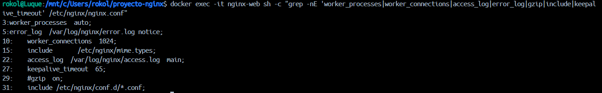
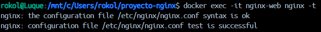
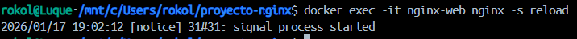


### b) Ampliacion de funcionalidad + modulo investigado
#### Opcion elegida: Opción B1: Gzip

#### Respuesta:

````bash
# Creo archivo gzip.conf

cat > config/gzip.conf << 'EOF'

# Activar compresión gzip

gzip on;

# Tipos MIME a comprimir
gzip_types text/plain text/css application/json application/javascript text/xml application/xml application/xml+rss text/javascript;

# Nivel de compresión (1-9, 5 es equilibrado)
gzip_comp_level 5;

# Añadir cabecera Vary: Accept-Encoding
gzip_vary on;

# Tamaño mínimo para comprimir (en bytes)
gzip_min_length 256;
EOF

# Añado montaje en docker-compose.yml
# Añado esta línea en volumes del servicio nginx-web:
# - ./config/gzip.conf:/etc/nginx/conf.d/gzip.conf:ro

# Reinicio servicios
docker compose down
docker compose up -d

# Valido configuración
docker exec -it nginx-web nginx -t

# Pruebo compresión gzip
curl -I -H "Accept-Encoding: gzip" http://localhost:8080/
curl -I -k -H "Accept-Encoding: gzip" https://localhost:8443/
````

**Explicación configuración**:

He activado la compresión gzip en Nginx para reducir el tamaño de las respuestas HTTP y mejorar el rendimiento de la aplicación. La configuración incluye:

- ``gzip on``: Activa la compresión

- ``gzip_types``: Lista de tipos MIME que se comprimirán (HTML, CSS, JS, JSON, XML)

- ``gzip_comp_level 5``: Nivel de compresión equilibrado entre CPU y ratio de compresión

- ``gzip_vary on``: Añade cabecera Vary para que proxies intermedios cacheen correctamente

- ``gzip_min_length 256``: Solo comprime archivos mayores de 256 bytes

La compresión puede reducir el tamaño de las respuestas hasta un 70-90%, mejorando significativamente la velocidad de carga.

#### Evidencias:

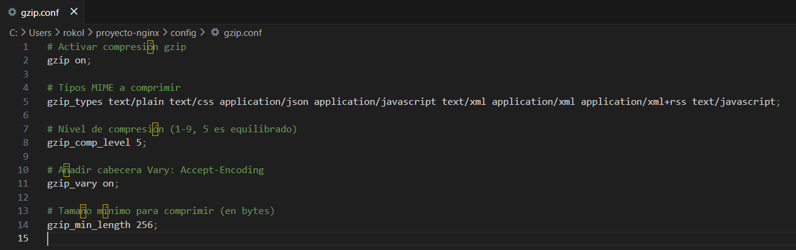

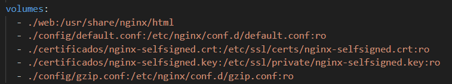


#### Modulo investigado: Módulo ngx_status
- Para que sirve: Este módulo proporciona una página con estadísticas básicas del servidor en tiempo real, incluyendo conexiones activas, peticiones totales, conexiones aceptadas/manejadas y estado de lectura/escritura. Es útil para monitorización básica sin herramientas externas.
- Como se instala/carga:
  - En la mayoría de distribuciones de Nginx, este módulo viene compilado por defecto
  - Para verificar si está disponible: nginx -V 2>&1 | grep -o with-http_stub_status_module
  - Se activa mediante configuración, añadiendo un location:

```nginx
location /nginx_status {
    stub_status on;
    access_log off;
    allow 127.0.0.1;
    deny all;
}
```

- Fuente(s):
  - Documentación oficial: https://nginx.org/en/docs/http/ngx_http_stub_status_module.html
  - Guía de uso: https://www.nginx.com/blog/monitoring-nginx/


### c) Sitios virtuales / multi-sitio
#### Respuesta:

````bash
docker exec -it nginx-web cat /etc/nginx/conf.d/default.conf
````

**Multi-sitio por path vs por nombre**:

- Multi-sitio por path: Utiliza el mismo dominio pero diferentes rutas (ej: ``example.com/`` y ``example.com/reloj``). Todas las aplicaciones comparten el mismo ``server_name`` y puerto, diferenciándose mediante directivas ``location``. Es ideal para aplicaciones relacionadas o submódulos de un mismo proyecto.

- Multi-sitio por nombre: Utiliza diferentes dominios (ej: ``app1.com`` y ``app2.com``) apuntando a la misma IP. Nginx diferencia las peticiones mediante la directiva ``server_name`` en bloques ``server`` separados. Permite aislar completamente diferentes proyectos.

**Tipos adicionales de multi-sitio**:

- Multi-sitio por puerto: Diferentes aplicaciones escuchan en puertos distintos (ej: puerto 80 para web pública, puerto 8080 para panel admin). Se configuran múltiples bloques ``server`` con diferentes ``listen``.

- Multi-sitio por IP: El servidor tiene múltiples IPs asignadas y cada aplicación se vincula a una IP específica mediante ``listen IP:puerto``. Útil en servidores con múltiples interfaces de red.

- Multi-sitio por subdominios: Similar al multi-sitio por nombre, pero usando subdominios del mismo dominio principal (ej: ``blog.example.com``, ``shop.example.com``). Se configura con ``server_name`` usando comodines o nombres específicos.

**Configuración actual (multi-sitio por path)**:

Mi ``default.conf`` implementa multi-sitio por path con las siguientes directivas clave:

- root: Define el directorio raíz ```/usr/share/nginx/html``` para el sitio principal

- location /: Sirve el contenido principal con ``try_files $uri $uri/ =404``

- location /reloj/: Directiva específica para la aplicación del reloj, con ``alias /usr/share/nginx/html/reloj/`` que mapea la ruta URL a un directorio físico específico

- absolute_redirect off: Evita redirecciones absolutas que perderían el puerto 8080

#### Evidencias:

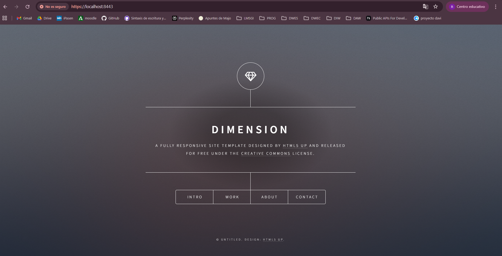


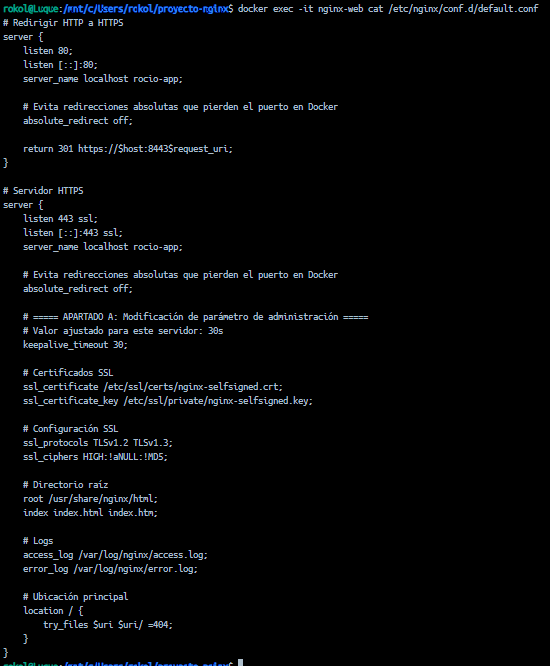

### d) Autenticacion y control de acceso

#### Respuesta:

````bash
# Creo directorio y contenido para /admin
mkdir -p web/admin
cat > web/admin/index.html << 'EOF'
<!DOCTYPE html>
<html lang="es">
<head>
    <meta charset="UTF-8">
    <meta name="viewport" content="width=device-width, initial-scale=1.0">
    <title>Panel de Administración</title>
    <style>
        body {
            font-family: Arial, sans-serif;
            background: linear-gradient(135deg, #667eea 0%, #764ba2 100%);
            display: flex;
            justify-content: center;
            align-items: center;
            height: 100vh;
            margin: 0;
        }
        .panel {
            background: white;
            padding: 2rem;
            border-radius: 10px;
            box-shadow: 0 10px 25px rgba(0,0,0,0.2);
            text-align: center;
        }
        h1 { color: #667eea; }
    </style>
</head>
<body>
    <div class="panel">
        <h1>Panel de Administración</h1>
        <p>Acceso restringido - Autenticación exitosa</p>
    </div>
</body>
</html>
EOF

# Genero archivo .htpasswd con usuario y contraseña
# Usuario: admin, Contraseña: Admin1234!
docker exec -it nginx-web sh -c "apt-get update && apt-get install -y apache2-utils"
docker exec -it nginx-web htpasswd -bc /etc/nginx/.htpasswd admin 'Admin1234!'

#  Modifico default.c onf añadiendo dentro del server block de HTTPS:
cat >> config/default.conf << 'EOF'

    # Protección para /admin/
    location /admin/ {
        auth_basic "Área Restringida";
        auth_basic_user_file /etc/nginx/.htpasswd;
    }
EOF

# Valido y recargo
docker exec -it nginx-web nginx -t
docker exec -it nginx-web nginx -s reload

# Pruebo sin credenciales (debe dar 401)
curl -I -k https://localhost:8443/admin/

# Pruebo con credenciales (debe dar 200)
curl -I -k -u admin:'Admin1234!' https://localhost:8443/admin/
````
#### Evidencias:

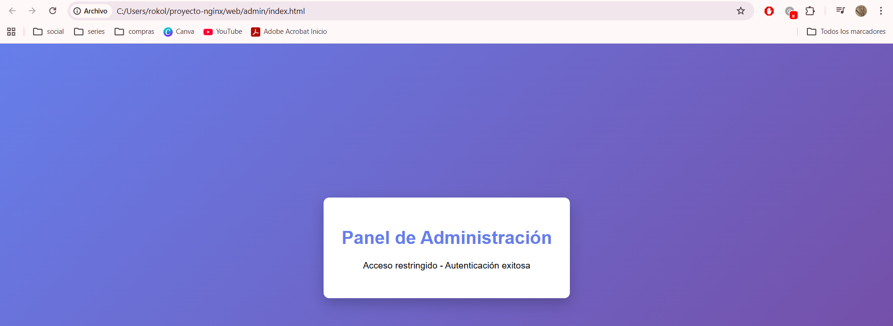


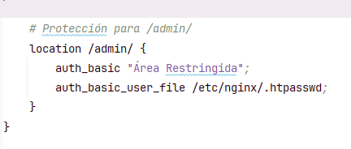


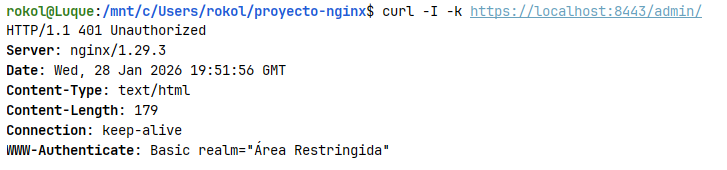


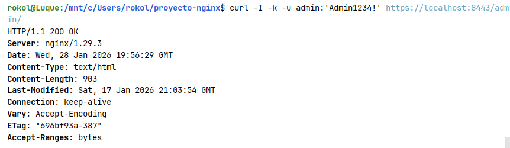


### e) Certificados digitales

#### Respuesta:

Para habilitar el cifrado SSL/TLS en el servidor, se han generado un certificado y una clave privada.

**Explicación de archivos y parámetros**:

- ```.crt``` (Certificate): Es el archivo que contiene la clave pública y la información de identidad del servidor, firmada (en este caso) por nosotros mismos. Se envía al cliente para establecer la confianza. 

- ```.key``` (Private Key): Es la clave privada que debe permanecer únicamente en el servidor. Se utiliza para descifrar los datos enviados por los clientes.

- ```-nodes``` (No DES): Este parámetro de OpenSSL se utiliza para que la clave privada no esté cifrada con una contraseña. En entornos de laboratorio y contenedores es fundamental, ya que de lo contrario Nginx se detendría al arrancar solicitando una clave de forma interactiva, lo cual no es posible en un proceso en segundo plano.

**Configuración aplicada**:

Se han montado los archivos mediante volúmenes en el contenedor y se han vinculado en el bloque server de HTTPS:

```nginx
    ssl_certificate /etc/ssl/certs/nginx-selfsigned.crt;
    ssl_certificate_key /etc/ssl/certs/nginx-selfsigned.key;
```

#### Evidencias:

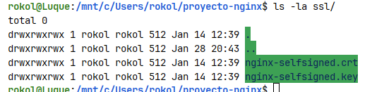

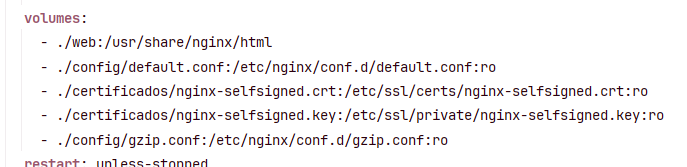

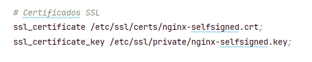


### f) Comunicaciones seguras

#### Respuesta:

La seguridad de la comunicación se garantiza forzando a todos los clientes a utilizar el protocolo HTTPS.

**Arquitectura de bloques de servidor**:

Se han configurado dos bloques ``server`` diferenciados por el puerto de escucha:

1. Bloque Puerto 80: Su única función es recibir peticiones inseguras y devolver un código de estado ``301 Moved Permanently``. Esto redirige al navegador de forma automática hacia la versión segura.

2. Bloque Puerto 443: Es el encargado de realizar el "handshake" SSL y servir el contenido cifrado.

Esta separación es una buena práctica porque evita procesar lógica de aplicación en conexiones no seguras y garantiza que ningún dato (como las credenciales de ```/admin```) viaje en texto plano.

#### Evidencias:


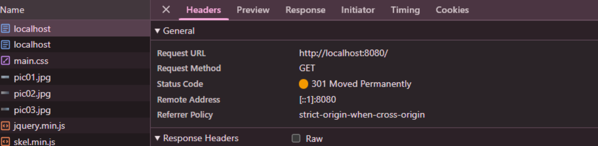


### g) Documentacion

#### Respuesta:

Este documento ``DESPLIEGUE.md`` contiene la documentación completa de la práctica, organizada en:

**Arquitectura del sistema**:
- Servicios: Nginx (puertos 8080/8443) y SFTP (puerto 2222)
- Volúmenes: webdata, config (default.conf, gzip.conf) y certificados SSL
- Red: red-practica (bridge)

**Configuración Nginx**:
- Dos server blocks: puerto 80 (redirección 301 a HTTPS) y puerto 443 (HTTPS con SSL)
- Locations: `/` (sitio principal), `/reloj/` (multi-sitio), `/admin/` (protegido con auth_basic)
- Optimizaciones: `keepalive_timeout 30`, `absolute_redirect off`, compresión gzip

**Seguridad**:
- Certificados SSL autofirmados (RSA 2048 bits, 365 días)
- HTTPS forzado con redirección 301
- Autenticación básica en `/admin/` (usuario: admin)

**Logs**: Monitorizados con `docker compose logs` y analizados con awk para métricas de URLs y códigos HTTP.


#### Evidencias:

**Parte 1 - Evidencias Mínimas**:

**Fase 1: Instalación y configuración**
1. Servicio Nginx activo → [Captura 2026-01-13 232312.png](evidencias/Captura%20de%20pantalla%202026-01-13%20232312.png) + [Captura 2026-01-14 000045.png](evidencias/Captura%20de%20pantalla%202026-01-14%20000045.png)
2. Configuración cargada → [Captura 2026-01-14 000125.png](evidencias/Captura%20de%20pantalla%202026-01-14%20000125.png)
3. Resolución de nombres → [Captura 2026-01-14 003832.png](evidencias/Captura%20de%20pantalla%202026-01-14%20003832.png)
4. Contenido Web → [Captura 2026-01-14 003832.png](evidencias/Captura%20de%20pantalla%202026-01-14%20003832.png)

**Fase 2: Transferencia SFTP**
5. Conexión SFTP exitosa → [Captura 2026-01-14 005512.png](evidencias/Captura%20de%20pantalla%202026-01-14%20005512.png)
6. Permisos de escritura → [Captura 2026-01-14 005835.png](evidencias/Captura%20de%20pantalla%202026-01-14%20005835.png) + [Captura 2026-01-14 005843.png](evidencias/Captura%20de%20pantalla%202026-01-14%20005843.png)

**Fase 3: Infraestructura Docker**
7. Contenedores activos → [Captura 2026-01-13 232312.png](evidencias/Captura%20de%20pantalla%202026-01-13%20232312.png)
8. Persistencia → [Captura 2026-01-14 010601.png](evidencias/Captura%20de%20pantalla%202026-01-14%20010601.png) + [Captura 2026-01-14 010613.png](evidencias/Captura%20de%20pantalla%202026-01-14%20010613.png) + [Captura 2026-01-14 011724.png](evidencias/Captura%20de%20pantalla%202026-01-14%20011724.png)
9. Despliegue multi-sitio → [Captura 2026-01-15 092903.png](evidencias/Captura%20de%20pantalla%202026-01-15%20092903.png)

**Fase 4: Seguridad HTTPS**
10. Cifrado SSL → [Captura 2026-01-14 122448.png](evidencias/Captura%20de%20pantalla%202026-01-14%20122448.png) + [Captura 2026-01-14 124121.png](evidencias/Captura%20de%20pantalla%202026-01-14%20124121.png) + [Captura 2026-01-14 124147.png](evidencias/Captura%20de%20pantalla%202026-01-14%20124147.png)
11. Redirección forzada → [Captura 2026-01-14 170748.png](evidencias/Captura%20de%20pantalla%202026-01-14%20170748.png) + [Captura 2026-01-14 170817.png](evidencias/Captura%20de%20pantalla%202026-01-14%20170817.png)


**Parte 2 - Evaluación RA2**:

**a) Parámetros de administración**:
- [a-01-grep-nginxconf.png](evidencias/a-01-grep-nginxconf.png) → Directivas en nginx.conf
- [a-02-nginx-t.png](evidencias/a-02-nginx-t.png) → Validación de configuración
- [a-03-reload.png](evidencias/a-03-reload.png) → Recarga de Nginx

**b) Ampliación de funcionalidad (Gzip)**:
- [b1-01-gzipconf.png](evidencias/b1-01-gzipconf.png) → Contenido de gzip.conf
- [b1-02-compose-volume-gzip.png](evidencias/b1-02-compose-volume-gzip.png) → Montaje en docker-compose.yml
- [b1-03-nginx-t.png](evidencias/b1-03-nginx-t.png) → Validación de configuración
- [b1-04-curl-gzip.png](evidencias/b1-04-curl-gzip.png) → Comprobación de compresión

**c) Sitios virtuales / multi-sitio**:
- [c-01-root.png](evidencias/c-01-root.png) → Sitio principal (/)
- [c-02-reloj.png](evidencias/c-02-reloj.png) → Sitio secundario (/reloj)
- [c-03-defaultconf-inside.png](evidencias/c-03-defaultconf-inside.png) → Configuración default.conf

**d) Autenticación y control de acceso**:
- [d-01-admin-html.png](evidencias/d-01-admin-html.png) → Contenido /admin/
- [d-02-defaultconf-auth.png](evidencias/d-02-defaultconf-auth.png) → Configuración auth_basic
- [d-03-curl-401.png](evidencias/d-03-curl-401.png) → Acceso sin credenciales (401)
- [d-04-curl-200.png](evidencias/d-04-curl-200.png) → Acceso con credenciales (200)

**e) Certificados digitales**:
- [e-01-ls-certs.png](evidencias/e-01-ls-certs.png) → Listado de certificados
- [e-02-compose-certs.png](evidencias/e-02-compose-certs.png) → Montaje en docker-compose.yml
- [e-03-defaultconf-ssl.png](evidencias/e-03-defaultconf-ssl.png) → Configuración SSL en default.conf

**f) Comunicaciones seguras**:
- [f-01-https.png](evidencias/f-01-https.png) → Navegación HTTPS
- [f-02-301-network.png](evidencias/f-02-301-network.png) → Redirección 301 en DevTools

**g) Documentación**: 
- *(Esta sección con toda la documentación técnica)*

**h) Ajustes para implantación de apps**:
- [h-01-root.png](evidencias/h-01-root.png) → Aplicación principal
- [h-02-reloj.png](evidencias/h-02-reloj.png) → Aplicación /reloj

**i) Virtualización en despliegue**:
- [i-01-compose-ps.png](evidencias/i-01-compose-ps.png) → Servicios activos

**j) Logs: monitorización y análisis**:
- [j-01-logs-follow.png](evidencias/j-01-logs-follow.png) → Monitorización en tiempo real
- [j-02-metricas.png](evidencias/j-02-metricas.png) → Extracción de métricas


### h) Ajustes para implantacion de apps

#### Respuesta:

Al desplegar aplicaciones adicionales como /reloj, es fundamental ajustar las rutas de los recursos.

**Problemas detectados y soluciones**:

- Rutas Relativas: Si la aplicación en ```/reloj``` usa rutas absolutas para sus scripts (ej: ```/js/main.js```), el navegador los buscará en la raíz del servidor principal y fallará. Se debe asegurar que la aplicación use rutas relativas o configurar un alias correcto en Nginx.

- Permisos SFTP: Al subir archivos vía SFTP, el propietario suele ser el usuario del servicio SSH. He configurado el contenedor SFTP y el volumen de forma que el usuario de Nginx tenga permisos de lectura sobre el contenido subido, evitando errores 403 (Forbidden).

#### Evidencias:


### i) Virtualizacion en despliegue

#### Respuesta:

Desplegar en contenedores ofrece una capa de abstracción que facilita la portabilidad.

**Diferencia operativa**:

- Nativo: La configuración depende de las librerías del sistema operativo. Una actualización del sistema podría romper el servidor web.

- Contenedor: El entorno de ejecución es idéntico en cualquier máquina. La configuración es "desechable" (si el contenedor falla, se recrea en segundos), mientras que la persistencia se garantiza mediante volúmenes externos que mantienen los datos de la web y los certificados a salvo.

#### Evidencias:

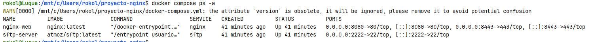


### j) Logs: monitorizacion y analisis

#### Respuesta:

Por defecto, Nginx registra cada petición en ```/var/log/nginx/access.log``` y cada problema técnico en ```/var/log/nginx/error_log```.

1. Generación de tráfico y simulación de errores: Para que el análisis de logs tenga sentido, primero he generado actividad de forma automatizada. He utilizado un bucle en la terminal para realizar 20 peticiones exitosas a la raíz y 10 peticiones a recursos que no existen. Esto permite "poblar" el archivo de log con códigos de estado 200 (OK) y 404 (Not Found).


2. Monitorización en tiempo real: Utilizando el comando ``docker logs -f nginx-web``, puedo observar el comportamiento del servidor en vivo. Cada vez que alguien accede a la web, el contenedor imprime una línea con la IP, la fecha, el método HTTP, la URL y el código de respuesta. Esto es vital para detectar ataques o fallos en el momento en que ocurren.


3. Análisis y extracción de métricas: Para consolidar la información y obtener estadísticas útiles sin leer miles de líneas, he ejecutado comandos de procesamiento de texto (awk, sort, uniq) dentro del contenedor. El archivo de log sigue un formato donde cada columna significa algo (la columna 7 es la URL, la 9 es el código de estado).
   - **Métrica de URLs**: Permite ver cuáles son las páginas más visitadas.

   - **Métrica de Códigos**: Permite ver de un vistazo si el servidor está dando muchos errores (4xx o 5xx).

   - **Métrica de Errores 404**: Específicamente útil para detectar enlaces rotos o intentos de escaneo por parte de bots.

#### Evidencias:

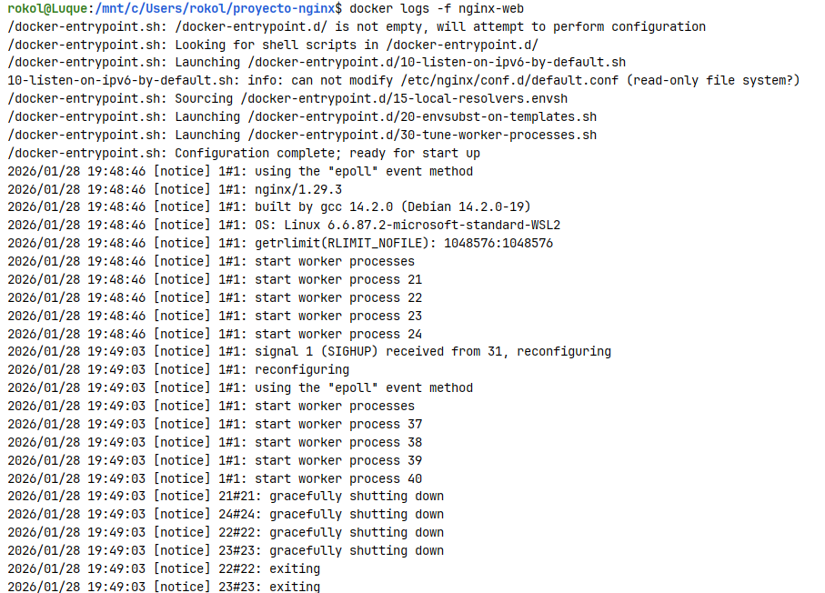


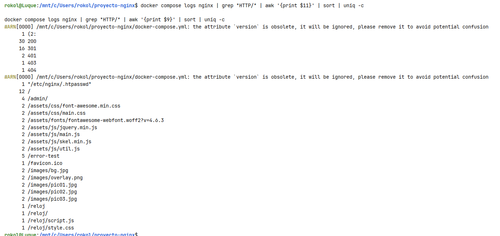


**Comandos ejecutados**:

````bash
# Generar tráfico
for i in {1..10}; do curl -s -I http://localhost:8080/ > /dev/null; done
for i in {1..5}; do curl -s -I http://localhost:8080/error-test > /dev/null; done

# Para ver los códigos de estado (200, 404, etc.)
docker compose logs nginx | grep "HTTP/" | awk '{print $11}' | sort | uniq -c

# Para ver las URLs solicitadas
docker compose logs nginx | grep "HTTP/" | awk '{print $9}' | sort | uniq -c
````

---

## Checklist final

### Parte 1
- [✅] 1) Servicio Nginx activo
- [✅] 2) Configuracion cargada
- [✅] 3) Resolucion de nombres
- [✅] 4) Contenido Web (Cloud Academy)
- [✅] 5) Conexion SFTP exitosa
- [✅] 6) Permisos de escritura
- [✅] 7) Contenedores activos
- [✅] 8) Persistencia (Volumen compartido)
- [✅] 9) Despliegue multi-sitio (/reloj)
- [✅] 10) Cifrado SSL
- [✅] 11) Redireccion forzada (301)

### Parte 2 (RA2)
- [✅] a) Parametros de administracion
- [✅] b) Ampliacion de funcionalidad + modulo investigado
- [✅] c) Sitios virtuales / multi-sitio
- [✅] d) Autenticacion y control de acceso
- [✅] e) Certificados digitales
- [✅] f) Comunicaciones seguras
- [✅] g) Documentacion
- [✅] h) Ajustes para implantacion de apps
- [✅] i) Virtualizacion en despliegue
- [✅] j) Logs: monitorizacion y analisis
